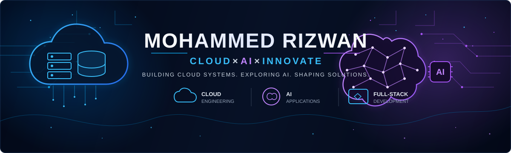
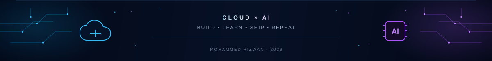

<div align="center">



<br/>


<br/>

# Mohammed Rizwan

### ☁️ Cloud & AI Developer   |   🤖 AI/LLM Applications   |   💻 Full-Stack Development

**Building cloud-based systems, exploring AI, and turning ideas into things that actually run.**

<br/>

<a href="https://www.linkedin.com/in/mohammedriizwan">

</a>
&nbsp;
<a href="mailto:riizwannx@gmail.com">

</a>
&nbsp;
<a href="https://github.com/riizwannx?tab=repositories">

</a>

</div>

<br/>

<table>
<tr>
<td width="58%" valign="top">

## 👨‍💻 About Me

I'm an early-career Computer Science developer exploring the intersection of **cloud infrastructure and AI-powered applications**.

I enjoy building complete systems — from APIs, authentication, and databases to deployment and infrastructure.

Currently focused on:

* ☁️ AWS & cloud architecture
* 🤖 AI / LLM applications
* 🔎 RAG & RAG evaluation
* ⚙️ AI automation workflows
* 🚀 Cloud deployment & infrastructure

<br/>

> **Build → Break → Understand → Improve → Repeat.**

</td>

<td width="42%" valign="top">

### `developer.config`

```javascript
const developer = {
  name: "Mohammed Rizwan",

  focus: [
    "Cloud",
    "AI",
    "Full-Stack"
  ],

  building: [
    "CloudDrive",
    "AI-powered systems"
  ],

  learning: [
    "AWS",
    "LLMs",
    "RAG",
    "Cloud Architecture"
  ],

  mindset:
    "Build. Learn. Improve."
};
```

</td>
</tr>
</table>

<br/>

# 🚀 Currently Building

<table>
<tr>
<td width="100%" valign="top">

### ☁️ CloudDrive

**Self-hosted File Storage & Workflow Platform**

CloudDrive is my main active project — a MERN-based platform for file management and storage that I'm evolving toward **cloud deployment and AI-powered workflows**.

<table>
<tr>

<td width="50%" valign="top">

#### ✅ Implemented

* REST APIs with Node.js & Express
* MongoDB Atlas data layer
* JWT-based authentication
* File management
* Storage-usage tracking
* Trash & recovery functionality

</td>

<td width="50%" valign="top">

#### 🧠 In Development

* AI-powered workflow & automation
* Docker-based deployment
* Nginx configuration
* Cloud deployment architecture

</td>

</tr>
</table>

<br/>

`MongoDB` `Express` `React` `Node.js` `JWT` `Docker`

</td>
</tr>
</table>

<br/>

# ⭐ Featured Project

<table>
<tr>

<td width="50%" valign="top">

### 🚑 LifeRoute

**Smart Ambulance Traffic & Hospital Alert System**

<sub>4-member team project</sub>

A real-time ambulance coordination system combining live location data, map visualization, and hospital alerts.

**Highlights**

* 📍 Firebase Realtime Database
* 🗺️ Leaflet live mapping
* 🔔 Telegram Bot API alerts
* ⚛️ React + Vite frontend
* ☁️ AWS EC2 deployment
* 🌐 Nginx

<br/>

`React` `Vite` `Firebase` `Leaflet` `Telegram Bot API` `AWS EC2` `Nginx`

</td>

<td width="50%" valign="top">

### ☁️ CloudDrive

**MERN File Storage & Workflow Platform**

My primary ongoing project focused on:

* Backend architecture
* Authentication
* File management
* Storage systems
* Cloud deployment
* AI-powered workflows

<br/>

**Project status**

`████████░░` **Active Development**

<br/>

<a href="https://github.com/riizwannx?tab=repositories">


</a>

</td>

</tr>
</table>

<br/>

# 🧰 Tech Stack

<table>
<tr>

<td width="25%" align="center">

### ☁️ Cloud & DevOps


</td>

<td width="25%" align="center">

### 💻 Languages


</td>

<td width="25%" align="center">

### 🌐 Full-Stack


</td>

<td width="25%" align="center">

### 🗄️ Databases


</td>

</tr>
</table>

<br/>

<table>
<tr>

<td width="50%" valign="top">

## 🤖 Currently Exploring

### ☁️ Cloud Architecture

`AWS` · `Infrastructure` · `Cloud-native applications`

### 🧠 AI Engineering

`LLMs` · `RAG` · `RAG Evaluation` · `AI Automation`

### ⚙️ Engineering

`Deployment` · `Containers` · `System Design`

> **Currently learning and building — not claiming professional-level proficiency.**

</td>

<td width="50%" valign="top">

## 🏆 Certifications

☁️ **AWS Cloud Foundations**

🌐 **Cisco CCNA**

🔐 **Cisco Cybersecurity Essentials**

<br/>

### 🔧 Additional Tools


</td>

</tr>
</table>

<br/>

# 📊 GitHub Activity

<div align="center">

<a href="https://github.com/riizwannx">


</a>

<a href="https://github.com/riizwannx">


</a>

</div>

<br/>

<table>
<tr>
<td width="65%" valign="top">

## 🤝 Let's Connect

Always open to interesting conversations, collaborations, and opportunities around:

**Cloud · AI · Software Engineering**

<br/>

<a href="https://www.linkedin.com/in/mohammedriizwan">

</a>

 

<a href="mailto:riizwannx@gmail.com">

</a>

</td>

<td width="35%" align="center">

### `> current_thought`

> **Code is how I build.**
>
> **Cloud is where I scale.**
>
> **AI is where I explore.**

☁️   🤖   🚀

</td>
</tr>
</table>

<br/>

<div align="center">



<br/>

<sub>Building in public · Learning continuously · Shipping things ☁️🤖</sub>

</div>
